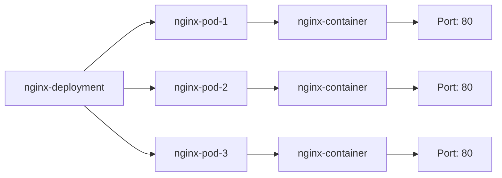

# IaC Report

The project contains the following deployments:

## KUBERNETES: `samples/combine/configs/deployment.yaml`

This deployment describes a Kubernetes deployment of an nginx application with 3 replicas. Each replica runs an nginx container with port 80 exposed.

### MEDIUM severity misconfigurations
* Runs as root user: 'runAsNonRoot' forces the running image to run as a non-root user to ensure least privileges.
* Image tag ':latest' used: It is best to avoid using the ':latest' image tag when deploying containers in production. Doing so makes it hard to track which version of the image is running, and hard to roll back the version.